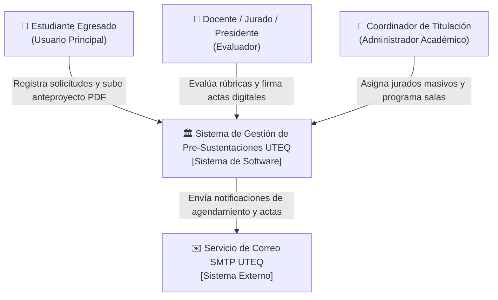
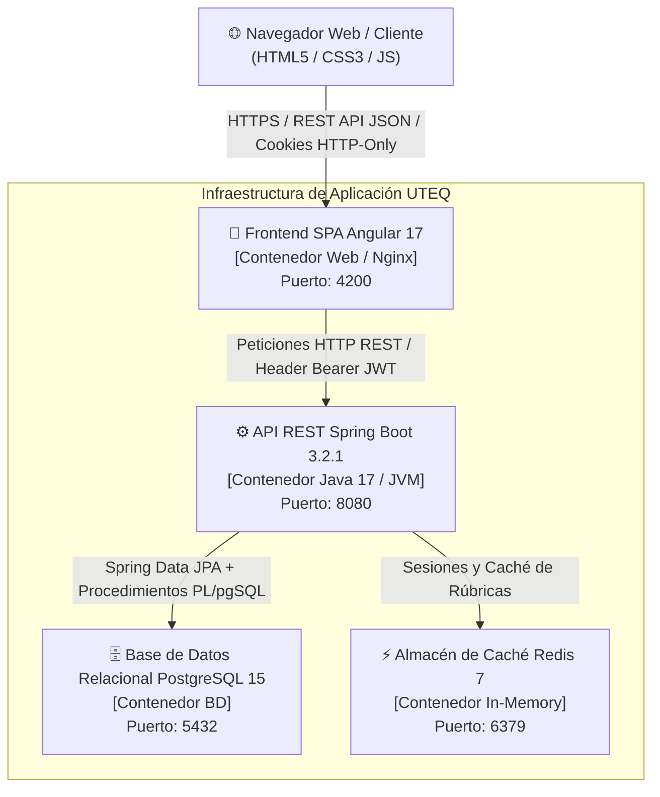
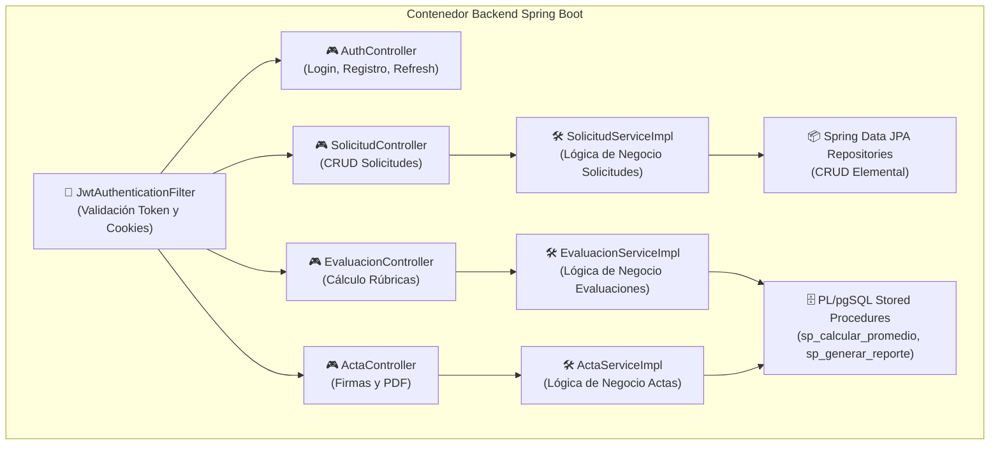

# 🏛️ ARQUITECTURA DEL SISTEMA (MODELO C4)

**Proyecto:** Sistema de Gestión de Pre-Sustentaciones UTEQ  
**Estándar:** Modelo C4 (Simon Brown) - Niveles 1, 2 y 3  

---

## 📌 Nivel 1: Diagrama de Contexto del Sistema (System Context)

El siguiente diagrama ilustra cómo el **Sistema de Pre-Sustentaciones UTEQ** interactúa con las diferentes personas (roles) y sistemas externos.

---

## 📌 Nivel 2: Diagrama de Contenedores (Containers)

El diagrama de contenedores describe las aplicaciones de alto nivel y almacenes de datos que conforman el sistema.

---

## 📌 Nivel 3: Diagrama de Componentes del Backend (Components)

El diagrama de componentes detalla la estructura interna del contenedor Backend (`presustentaciones.jar`).

