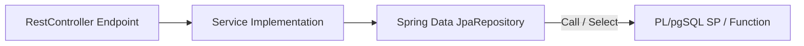

# FASE 3 — AUDITORÍA INICIAL DE BASE DE DATOS Y FLUJOS DE JAVA

**Proyecto:** Sistema de Gestión de Pre-Sustentaciones UTEQ  
**Fase de Trabajo:** Fase 3 — Procedimientos Almacenados y Conexión Real con Java  
**Estado de Auditoría:** COMPLETADA  

---

## 1. Mapeo de Entidades JPA y Tablas Físicas de PostgreSQL

A partir de la inspección detallada del archivo `V1__schema_inicial.sql` y las clases en `ec.edu.uteq.presustentaciones.entities.*`, se consolida la correspondencia real del esquema:

| Entidad JPA | Tabla física (`presus.`) | Clave Primaria | Relaciones Clave | Columnas Críticas Verificadas |
|---|---|---|---|---|
| `Solicitud` | `solicitud` | `id` (BIGINT) | `estudiante_id` → `estudiante.id` `estado_id` → `estados_solicitud.id` | `titulo_tema` (VARCHAR), `fecha_registro` (TIMESTAMP) |
| `Estudiante` | `estudiante` | `id` (BIGINT) | `usuario_id` → `usuarios.id` | `expediente_codigo` (VARCHAR), `carrera` (VARCHAR) |
| `Usuario` | `usuarios` | `id` (BIGINT) | - | `nombre`, `apellido`, `email`, `rol` |
| `Jurado` | `miembros_tribunal` | `id` (BIGINT) | `docente_id` → `docente.id` `solicitud_id` → `solicitud.id` `rol_jurado_id` → `roles_jurado.id` | `confirmado` (BOOLEAN), `asignado_en` (TIMESTAMP) |
| `Acta` | `actas` | `id` (BIGINT) | `solicitud_id` → `solicitud.id` | `firmada` (BOOLEAN), `firmada_presidente`, `firmada_vocal1`, `firmada_vocal2`, `firmada_tutor` |
| `EvaluacionFinal`| `evaluaciones_finales`| `id` (BIGINT) | `solicitud_id` → `solicitud.id` `resultado_id` → `resultados_evaluacion.id` | `nota_instructor`, `nota_jurado_promedio`, `nota_final`, `peso_instructor`, `peso_jurado`, `fecha_calculo` |
| `TutoriaFase` | `tutoria_fases` | `id` (BIGINT) | `tutor_id` → `tutores.id` | `numero_fase` (INT), `estado` (VARCHAR), `archivo_pdf_estudiante` (VARCHAR) |

---

## 2. Diagnóstico de Discrepancias en Procedimientos Existentes (`V2`)

Se identificaron los siguientes desajustes de nombres en `V2__stored_procedures.sql` respecto al modelo real del backend actual:

1.  **`sp_calcular_promedio_evaluacion`**:
    - *Error en V2*: Actualiza y lee de la tabla `evaluaciones`, la cual está obsoleta para la evaluación final ponderada del anteproyecto.
    - *Solución*: Modificar para que lea y escriba en `evaluaciones_finales` (`nota_jurado_promedio`, `nota_final`, `resultado_id`, `fecha_calculo`). Vincular el resultado con la tabla y secuencia `resultados_evaluacion`.
2.  **`sp_generar_reporte_defensas`**:
    - *Error en V2*: Usa nombres en plural como `solicitudes`, `estudiantes`, `cronogramas`, `salas`, y la tabla obsoleta `evaluaciones`.
    - *Solución*: Rediseñar usando los nombres reales (`solicitud`, `estudiante`, `usuarios`, `cronograma`, `sala`, `evaluaciones_finales`, `estados_solicitud`). Cambiar `c.fecha_defensa` por `c.fecha_inicio`.
3.  **`sp_asignar_jurado_masivo`**:
    - *Error en V2*: Inserta en la tabla `jurados` usando la columna `rol` de tipo VARCHAR directamente.
    - *Solución*: Modificar para que inserte en la tabla real `miembros_tribunal` y se asocie a `roles_jurado` utilizando `rol_jurado_id`.
4.  **`sp_firmar_acta_digital`**:
    - *Error en V2*: Actualiza los flags de firmas individuales en `actas` pero no consolida el estado del campo `firmada` (el cual debe ser `true` únicamente si los cuatro firmantes confirmaron).
    - *Solución*: Agregar una sentencia final de actualización de estado para setear `firmada = (firmada_presidente AND firmada_vocal1 AND firmada_vocal2 AND firmada_tutor)`.

---

## 3. Estrategia de Implementación y Conexión Híbrida

Para conectar de forma segura y sin efectos destructivos los procedimientos almacenados en Java, se aplicará el siguiente flujo:

### Plan de Conexión Java:
- **`sp_calcular_promedio_evaluacion`**: Mapeado en `EvaluacionFinalRepository` mediante `@Query(..., nativeQuery = true)`.
- **`sp_generar_reporte_defensas`**: Mapeado en `SolicitudRepository` mediante `@Query(..., nativeQuery = true)`.
- **`sp_asignar_jurado_masivo`**: Mapeado en `JuradoRepository` mediante `@Procedure`.
- **`sp_firmar_acta_digital`**: Mapeado en `ActaRepository` mediante `@Procedure`.
- **`sp_obtener_estadisticas_tutores`** (Nuevo): Mapeado en `TutorRepository` mediante `@Query(..., nativeQuery = true)`.
- **`sp_registrar_tutoria_avance`** (Nuevo): Mapeado en `TutoriaFaseRepository` mediante `@Procedure`.
