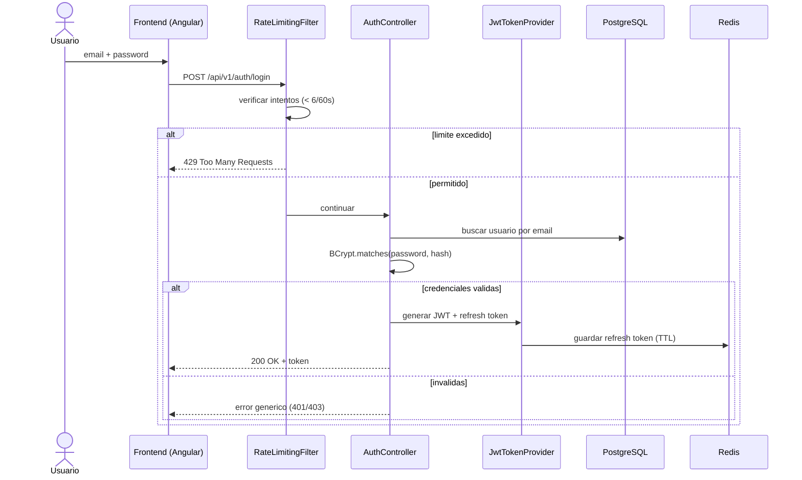

# CU-01: Autenticarse en el sistema

**Nivel Cockburn:** 🌊 Mar (meta de usuario) · **Requisito:** RF-01 · **Historia relacionada:** [`../historias/HU-01.md`](../historias/HU-01.md)

**Actor primario:** Cualquier usuario registrado (Estudiante, Docente, Coordinador, Administrador).
**Interesados y sus intereses:**
- *Usuario:* quiere acceder rápido y de forma segura.
- *Administrador de seguridad:* quiere que credenciales inválidas o ataques de fuerza bruta se rechacen.
- *Institución (UTEQ):* quiere que las sesiones no comprometan datos académicos sensibles.

**Precondición:** el usuario existe en la tabla `usuarios` con una contraseña hasheada con BCrypt.
**Garantía mínima:** ningún intento fallido revela si el email existe o no (mismo mensaje de error).
**Garantía de éxito:** el usuario recibe un JWT válido (7 claims RFC 7519) y un refresh token.
**Disparador:** el usuario envía sus credenciales desde el formulario de login.

## Escenario principal (éxito)
1. El usuario ingresa email y contraseña en el frontend.
2. El frontend envía `POST /api/v1/auth/login`.
3. El sistema verifica el rate limiter (< 6 intentos/60s para ese origen).
4. El sistema busca el usuario por email y verifica la contraseña con BCrypt.
5. El sistema genera un JWT (jti, iss, sub, aud, iat, nbf, exp) y un refresh token, lo guarda en Redis.
6. El sistema responde 200 con el token envuelto en `ResponseWrapper`.
7. El frontend guarda el token y redirige al dashboard correspondiente al rol.

## Extensiones (flujos alternos)
- **3a.** Rate limit excedido → el sistema responde 429 sin consultar la base de datos.
- **4a.** Usuario no existe o contraseña incorrecta → el sistema responde con error genérico (nunca revela cuál de los dos falló).
- **5a.** Token previamente emitido está en blacklist (p. ej. tras logout) → se invalida y no se reutiliza.

**Postcondición:** existe una sesión JWT stateless válida; se registró el refresh token en Redis con TTL.

## Diagrama de secuencia

## Trazabilidad
- **Prueba automatizada:** ✅ `JwtTokenProviderTest.java`, `Phase4FeaturesTest.java`, `AuthControllerIntegrationTest.java` (slice test `@WebMvcTest`, no integración completa).
- **Prueba de integración real (`@SpringBootTest` + BD real):** ❌ no existe todavía — ver nota en [`README.md`](README.md).
